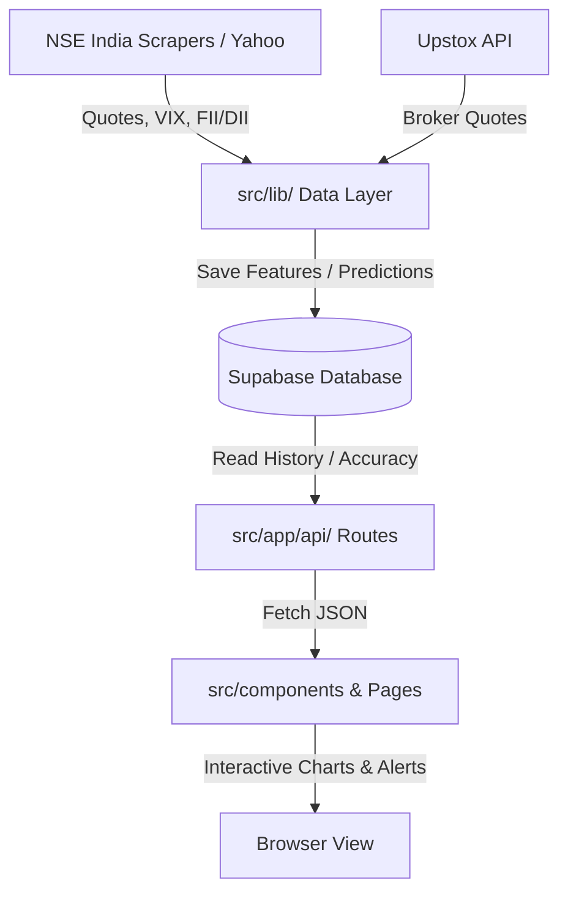

# MarketPulse AI — Codebase Knowledge Graph & Index Map

This file acts as a lightweight static knowledge graph and index map for the codebase. Read this map first to understand project relationships and architectures before searching or reading entire directories.

---

## 🏛️ Project Directory Structure

```
market-pulse/
├── src/
│   ├── app/                 # Next.js App Router Pages & API Routes
│   │   ├── api/             # Backend API endpoints (market data, regime, predictions, etc.)
│   │   ├── broker/          # Broker authentication and status
│   │   ├── heatmap/         # Nifty 50 Heatmap visualization
│   │   ├── news/            # News Feed page
│   │   ├── predictions/     # AI Predictions Dashboard & backtest metrics
│   │   ├── sector/          # Sector-specific detail pages [id]
│   │   ├── sectors/         # Sectors list and sentiment matrix
│   │   ├── stock/           # Stock-specific detail pages [symbol]
│   │   └── watchlist/       # Watchlist management
│   ├── components/          # Reusable UI Components
│   │   ├── AlertManager.tsx # Notification configuration & alert history panel
│   │   ├── BacktestCard.tsx # ML model simulation backtest visualizer
│   │   ├── FIIDIIWidget.tsx # FII/DII Institutional Flows visualizer
│   │   ├── MarketRegimeWidget.tsx # Market Regime bull/bear compass and gauges
│   │   ├── Sidebar.tsx      # Main application navigation
│   │   └── TradingViewChart.tsx # Lightweight-Charts interactive candle chart
│   ├── context/             # React Contexts (Auth, etc.)
│   └── lib/                 # Core Business Logic & Data Fetching
│       ├── brokerApi.ts     # Upstox broker API & authentication wrapper
│       ├── dataQuality.ts   # Data quality checks & metrics validation
│       ├── fiiDiiData.ts    # FII/DII flow fetchers (NSE) & Supabase sync
│       ├── marketRegime.ts  # Bull/Bear/Sideways classifier & risk adjustments
│       ├── nseData.ts       # NSE stock quotes and India VIX scrapers
│       ├── predictionHistory.ts # Prediction resolver, accuracy & dedup logs
│       ├── priceAlerts.ts   # Client-side price & target notification engine
│       └── supabase.ts      # Supabase connection clients
```

---

## 📊 Core Data Flows & Relationships



### 1. Data Ingestion & ML Pipeline
*   **Cron Trigger:** `/api/cron/collect` executes at 8:30 AM IST daily.
*   **Feature Collection:** Fetches 38 technical and sentiment features for the top Nifty stocks. Saves to `daily_features` table.
*   **Prediction Model:** Generates next-day directional forecast (Bullish/Bearish) and probability (%), saving to `prediction_history`.
*   **Resolution:** When next day close data is available, resolves past predictions as `correct` or `incorrect` to update live win rates.

### 2. Market Regime & Risk Calibration
*   `marketRegime.ts` calculates a composite score (-100 to +100) using:
    *   **Trend:** Nifty position vs EMA20/50.
    *   **Momentum:** RSI readings.
    *   **Volatility:** India VIX level (complacency vs fear).
    *   **Breadth:** % of Nifty stocks above their EMA20.
    *   **Flows:** 5-day moving average of net FII/DII buying.
*   The resulting regime (`strong_bull` to `strong_bear`) returns risk adjustment multipliers applied directly to active predictions in the UI and ML outputs.

### 3. Client-Side Notifications & Alerts
*   `priceAlerts.ts` handles browser Notification API permissions and stores alert conditions (confidence threshold, direction flips, price target targets) in `localStorage`.
*   Monitors live quote updates via Stock page and fires native push notifications when thresholds trigger.
